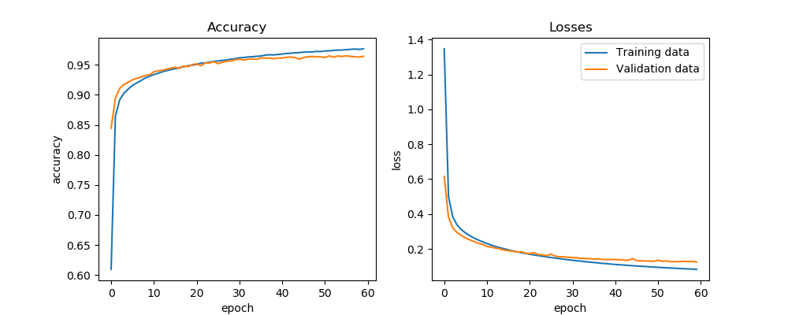
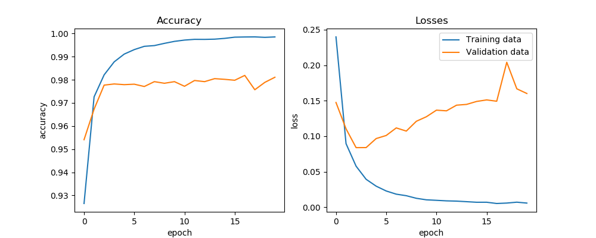
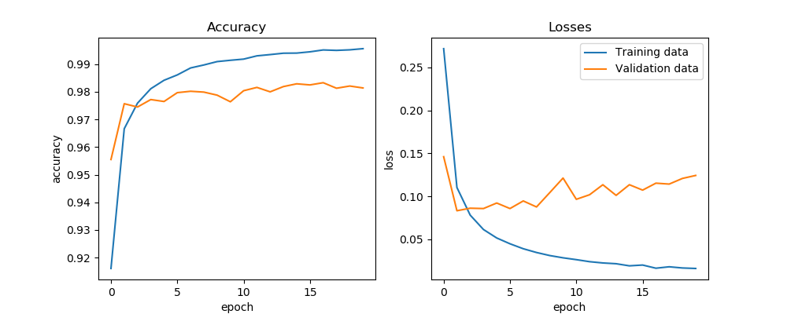

# Keras for MNIST data set

The task is to rain a model to recognize the MNIST data set and plot accuracy.

## Usage

The simple model (28 neuros) can be trained with:

```sh

python train_small.py

```

and the bigger (512 neurons per layer and using dropout) with:

```sh

python train_wdropout.py

```


## An example run

```sh

	(keras-projects) tero@Ubik:~/Projects/keras-projects/mnist$ python train.py
	Using Theano backend.
	Input: 60000 samples in training set (of which 9960 are used for validation) and 10000 samples in test test.
	____________________________________________________________________________________________________
	Layer (type) Output Shape Param # Connected to
	====================================================================================================
	dense_1 (Dense) (64, 28, 28) 812 dense_input_1[0][0]
	____________________________________________________________________________________________________
	dense_2 (Dense) (64, 28, 28) 812 dense_1[0][0]
	____________________________________________________________________________________________________
	flatten_1 (Flatten) (64, 784) 0 dense_2[0][0]
	____________________________________________________________________________________________________
	dense_3 (Dense) (64, 10) 7850 flatten_1[0][0]
	====================================================================================================
	Total params: 9,474
	Trainable params: 9,474
	Non-trainable params: 0
	____________________________________________________________________________________________________
	Train on 50040 samples, validate on 9960 samples
	Epoch 1/120
	50040/50040 [==============================] - 2s - loss: 1.3150 - acc: 0.6287 - val_loss: 0.5515 - val_acc: 0.8499
	.
	.
	.
	Epoch 120/120
	50040/50040 [==============================] - 4s - loss: 0.0853 - acc: 0.9743 - val_loss: 0.1158 - val_acc: 0.9689
	Final score: 0.116527532629
	Final accuracy: 0.965

```

## Results

The models are 2 hidden layers deep. The example shows the details of the model.

50000 images are used for training, 10000 for development (validation) and 10000 for testing for final accuracy.

### 2 hidden layer, 28 neuron per layer model

Right of the bat with a small non-optimized model we get an accuracy of about 96,5% which is awesome. No sweating
with feature engineering either.



### 2 hidden layer, 512 neuron per layer model (with dropout)

We get final accuracy of 98.04% after 20 epochs.

The bigger model takes considerably more time to train without a GPU. 



### 2 hidden layer, 512 neuron per layer model (without dropout)

Final accuracy of 98.36% after 20 epochs.


